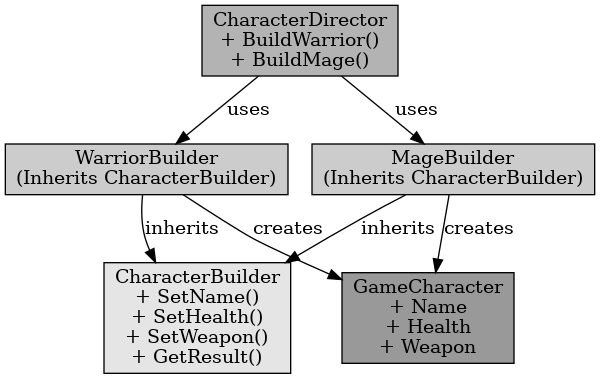

## 빌더 패턴

빌더 패턴

---

빌더 패턴은 생성(Construction)과 표기(Representation)를 분리해 복잡한 객체를 생성한다. 작게 분리된 인터페이스를 건축하듯이 조합하여 객체를 생성한다. 동일한 객체 생성 과정에서 다른 구성을 제공해 준다.

언리얼 엔진에서는 복잡한 오브젝트를 생성하거나 초기화가 필요할 때 사용한다. 
예를 들어 플레이어가 생성될 때 플레이어의 무기를 설정해 주거나 체력을 설정해 주는 것을 말한다. 

 

빌더 패턴은 복잡한 객체 생성 과정을 단계별로 나눠 유연하게 객체 생성을 하는 패턴이다.