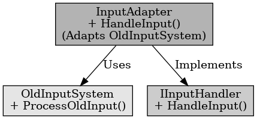

## 어댑터 패턴

어댑터 패턴

---

어댑터 패턴은 디자인 패턴 중 구조 패턴에 해당되는 패턴으로 인터페이스가 호환되지 않는 클래스들을 함께 이용할 수 있도록 다른 클래스의 인터페이스를 기존 인터페이스에 덧쓰운다. 
기존에 구현되어 있는 클래스에 기능 발생 시 기존 클래스를 재사용 할 수 있도록 중간에 맞춰주는 역할을 한다.

언리얼 엔진에서 어댑터 패턴은 기존 시스템과 새로운 시스템을 연결하고 싶을 때 사용한다.
예를 들어 플레이어와 적이 같은 MovementComponent 클래스를 공유하는데 플레이어에게만 점프와 회피 기능을 만들고 싶을 때 기존 클래스를 상속받아 점프와 회피 기능을 따로 구현하여 사용할 수 있다.

 

어댑터 패턴은 호환되지 않는 인터페이스를 가진 객체를 연결하여 함께 동작하도록 하는 것이다.