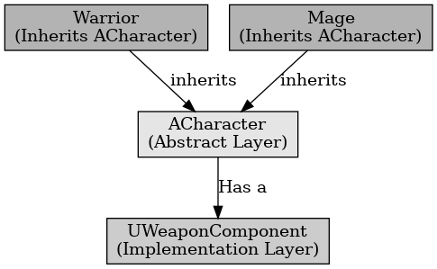

## 브릿지 패턴

브릿지 패턴

---

브리지 패턴은 디자인 패턴 중 구조 패턴의 하나로 구현부에서 추상층을 분리하여, 서로가 독립적으로 확장할 수 있도록 구성한다. 하나의 클래스를 여러 개의 독립적인 계층으로 나눠 유지 보수에 용이하고 확장성이 높아다. 이는 계속 상속을 계속 받아 관리하기 어려운 상황을 해결하는 데 유용하다다.

언리얼에서 예를 들면 캐릭터가 무기를 가진다고 할 때 캐릭터와 무기를 직접적으로 연결하여 사용하면 캐릭터들과 무기의 관리가 어렵다.
캐릭터에 무기 시스템을 활용하여 캐릭터와 무기를 따로 관리하고 서로 조합하면 캐릭터에 상관없이 자유롭게 무기 사용이 가능하다.

 

브릿지 패턴은 코드의 유연성을 높이고 관리가 편하게 만들어준다.