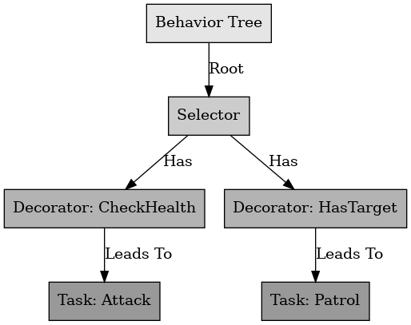
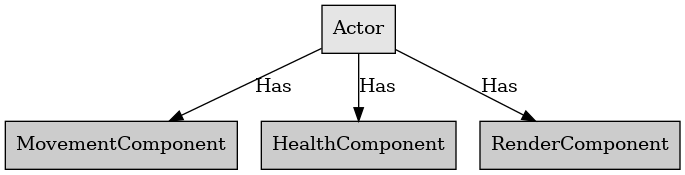

## 데코레이터 패턴

데코레이터 패턴

---

데코레이터 패턴은 디자인 패턴 중 구조 패턴의 한 종류로, 상속을 사용하지 않고 임의의 객체에 부가적인 기능을 추가하기 위해 다른 객체들을 덧붙이는 방식으로 구현한다.

언리얼 엔진에서 AI를 제어하는 Behavior Tree의 데코레이터 기능도 이러한 데코레이터 패턴을 이용한 것이다. 데코레이터 패턴을 이용하면 특정 기능을 원하는 타이밍에 쉽게 제어가 가능하다.

 

언리얼 엔진에서 기본적인 기능만 가진 플레이어가 있다고 가정한다. 플레이어에게 기본적인 기능 이외의 플레이어가 움직이게 하기 위해 MovementComponent를 이용하거나 체력을 관리하기 위해 HealthComponent를 만들어 사용하기도 한다. 이때 MovementComponent와 HealthComponent는 데코레이터의 역할을 한다.

 

데코레이터 패턴을 이용하면 기존의 클래스를 변경하지 않아도 더 많은 기능을 쉽게 추가하여 조합이 가능하다.