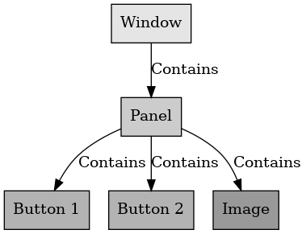

## 컴포지트 패턴

컴포지트 패턴

---

컴포지트 패턴은 디자인 패턴 중 구조 패턴으로 객체들의 관계를 트리 구조로 구성하여 디렉토리 안에 디렉터리가 있듯이 복합 객체 안에 복합 객체가 포함되는 구조이다.

언리얼 엔진에 비유하면 게임 UI를 만들 때 사용하는 Button, Panel, Image 등 개별 요소들을 따로 관리하면 처리해야 하는 양이 많이 때문에 코드가 복잡하고 관리가 어렵다. 
하지만 Grid나 Panel 아래에 Button이나 Image와 같은 요소를 넣어 관리하면 자식들끼리 같이 처리가 가능하다.

 

컴포지트 패턴은 모든 구성 요소를 개별적으로 처리하는 것이 아닌 묶어서 한 번에 처리가 가능해 코드가 간결하고 빠르게 사용할 수 있다.