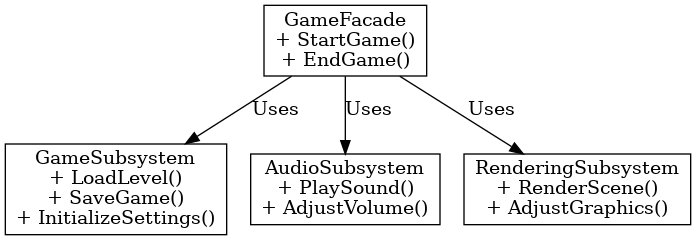

## 퍼사드 패턴

퍼사드 패턴

---

퍼사드 패턴은 디자인 패턴 중 구조 패턴에 포함되는 것으로 클라이언트와 서브시스템 사이에 퍼사드 객체를 세워놓음으로써 복잡한 관계를 구조화한 디자인 패턴이다. 이는 일련의 클래스에 대해 간단한 인터페이스를 제공한다.

언리얼 엔진에서 게임 로직은 여러 하위 시스템으로 구성이 되는데 게임이 시작될 때 하위 시스템을 하나씩 초기화하는 것이 아닌 퍼사드 클래스에서 모든 초기화와 관리를 처리하도록 하는 것이다. 
이때 하위 시스템의 예시로는  UI, 사운드, AI, Input System 등 부모를 가지는 시스템들을 말한다.

 

퍼사드 패턴은 복잡한 하위 시스템에 대해 단순한 인터페이스를 제공하는 패턴이다.