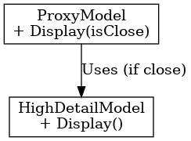

## 프록시 패턴

프록시 패턴

---

프록시 패턴은 객체를 감싸서 그 객체에 대한 접근성을 제어하기 위해 대리자 객체를 사용하는 것이다. 대지라는 실제 객체에 대한 인터페이스를 제공하고 접근을 제어하거나 기능을 확장 시킨다. 

언리얼 엔진에서 LOD(Level Of Detail)은 프록시 패턴과 매우 유사하다. 
플레이어에게서 멀리 있는 객체는 낮은 해상도를 사용하고 플레이어와 가까운 객체는 높은 해상도 교체해준다. 이때 멀리 있는 객체를 낮은 해상도의 모델로 교체 해주는 것이 대리자가 해주는 역할이다.

 

프록시 패턴은 실제 객체에 대한 접근을 제어하기 위한 대리자 객체를 사용하는 패턴으로 추가 기능을 설정하는데 유용하다.