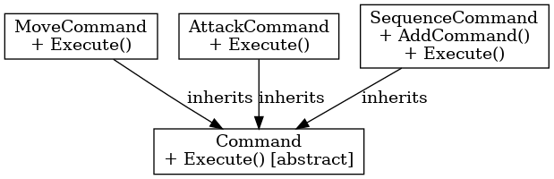

## 인터프리터 패턴

인터프리터 패턴

---

인터프리터 패턴은 디자인 패턴 중 행위 패턴에 해당되는 것으로 간단한 문법에 기반한 검증 작업 및 작업 처리를 한다. 특정 언어나 표현식을 해석하고 평가하는 방법을 제공한다.

언리얼 엔진에서 인터프리터 사용하면 스크립트를 해석할 때나 상태 머신과 같은 기능에서 사용이 가능하다. 또한 블루 프린트 노드의 동작 해석이나 커스텀 이벤트 시스템에서 해당 패턴을 사용할 수 있다.

 

인터프리터 패턴은 언어의 문법을 정의하고, 표현식을 해석하는 패턴이다.