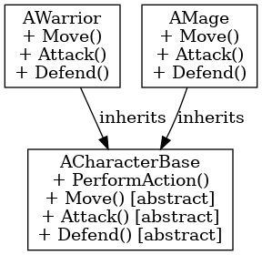

## 템플릿 메서드 패턴

템플릿 메서드 패턴

---

템플릿 메서드 패턴은 디자인 패턴 중 행위 패턴에 해당되는 것 중 하나로 알고리즘의 개별 단계를 구현하는 방법을 서브 클래스에서 결정한다.

언리얼 엔진에서는 캐릭터의 행동, AI의 동작과 같이 반복적인 알고리즘이 필요할 때 템플릿 메서드 패턴을 활용할 수 있다. 예를 들어 AI에서 추격, 공격 등 기본적인 흐름을 템플릿 메서드로 정의하고 그의 하위 클래스에 탐색, 회피 등과 같은 행동을 구현할 수 있다.

 

템플릿 메서드 패턴은 알고리즘의 기본 흐름을 상위 클래스에서 정의하고, 세부 동작만 하위 클래스에서 구현하는 패턴이다.
