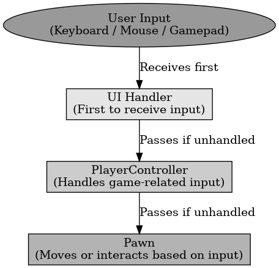

## Chain Of Responsibility 패턴

Chain Of Responsibility 패턴

---

Chain Of Responsibility는 디자인 패턴의 행위 패턴 중 하나로 여러 개의 처리 객체들이 연결되어 순차적으로 요청을 처리하는 것이다. 하나의 요청이 여러 객체를 거치면서 해당 객체가 처리할지 넘길지를 결정한다.

언리얼 엔진의 입력 처리에서 키 입력이 여러 객체를 거치는 것을 Chain Of Responsibility 패턴의 예시라고 할 수 있다. 예를 들어 UI에서 키 입력을 받고 이를 캐릭터에 전달하는 것을 말할 수 있다.

 

Chain Of Responsibility 패턴은 요청을 여러 개의 핸들러가 순차적으로 처리하는 패턴이다.
