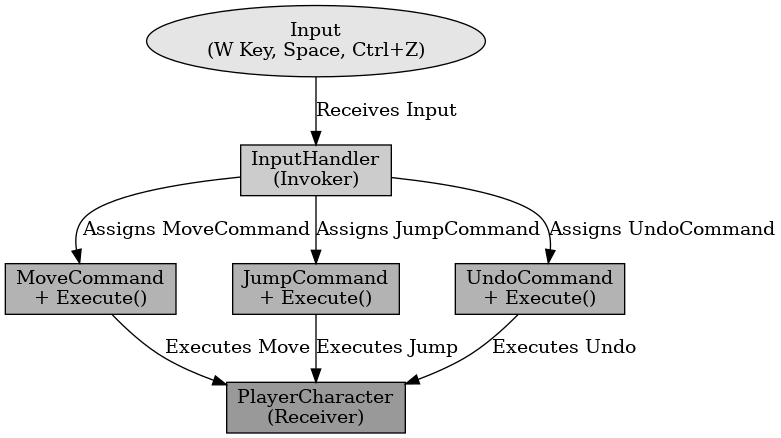

## 커맨드 패턴

커맨드 패턴

---

커맨드 패턴은 디자인 패턴중 행위 패턴으로 객체로 캡슐화하여 호출자와 실행자를 분리하는 것을 말한다. 명령을 실행하는 객체와 명령을 내리는 객체를 분리하여 유연하게 관리한다.

언리얼 엔진에서 키 입력을 명령 객체로 캡슐화하여, 특정 키를 눌렀을 때 실행될 동작을 동적으로 변경이 가능하다.

 

커맨드 패턴은 요청을 객체로 캡슐화하여 실행자와 호출자를 분리하는 패턴이다.