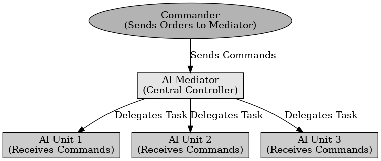

## 미디에이터 패턴

미디에이터 패턴

---

미디에이터 패턴은 디자인 패턴 중 행위 패턴에 속하는 것으로 객체 간의 직접적인 상호작용을 제거하고, 중앙에서 통신을 관리하는 시스템을 말한다. 객체들이 직접 소통하지 않고, 중재자를 통해 간접적으로 소통한다.

언리얼 엔진에서 여러 AI 객체들이 개별적으로 행동하는 대신 중앙 AI 컨트롤러가 적절한 행동을 조정한다. AI들끼리 통신을 하는 것이 아닌 중앙을 이용하여 통신한다.

 

미디에이터 패턴은 객체 간의 직접적인 통신을 줄이고, 중앙에서 조정하는 패턴을 말한다.