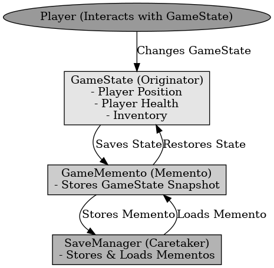

## ​메멘토 패턴

메멘토 패턴

---

메멘토 패턴은 디자인 패턴 중 행위 패턴으로 객체의 상태를 저장하고, 필요할 때 복원하는 패턴이다. 실행 취소를 구현할 때 유용한 패턴으로 객체를 이전 상태로 보존하고 복원한다.

언리얼 엔진에서 플레이어의 상태를 메멘토로 저장하고 필요할 때 복원할 때 사용한다. 게임 중간 저장 및 되돌리기 기능을 구현할 수 있다.

 

메멘토 패턴은 객체의 상태를 저장하고, 필요할 때 복원할 수 있도록 하는 패턴이다.