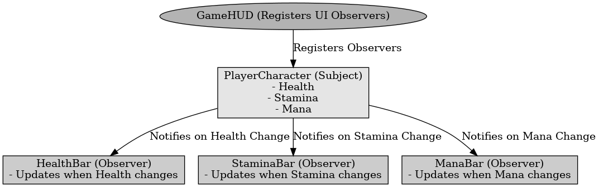

## 옵저버 패턴

옵저버 패턴

---

옵저버 패턴은 디자인 패턴 중 행위 패턴으로 한 객체의 상태가 바뀌면 그 객체에 의존하는 다른 객체들한테 연락이 가고 자동으로 내용이 갱신되는 방식으로 일대 다 의존성을 가지는 패턴이다. 서로 상호작용을 하는 객체 사이에서는 가능하면 느슨하게 결합하는 디자인을 사용해야한다.

언리얼 엔진에서 플레이어의 체력이 변화할때 UI에서 감지하여 체력바를 업데이트 할때 사용한다. UI가 캐릭터의 상태를 매번 확인하는 것이 아닌 상태가 변경할때 업데이트 된다.

 

옵저버 패턴은 객체간의 일대 다 관계를 유지하며, 상태 변경이 발생하면 구독자에게 자동으로 알림을 보내는 패턴이다.