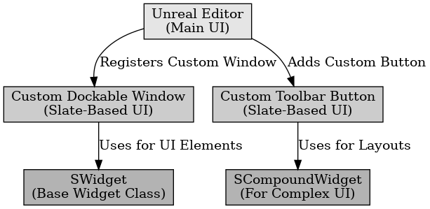

## 슬레이트 패턴

슬레이트 패턴

---

슬레이트 패턴은 언리얼 엔진의 UI 프레임워크인 Slate에서 사용하는 디자인 패턴이다. Slate 기반의 UI 시스템을 구성하고 관리하는 방식을 사용한다. 경량 UI 프레임워크로 빠른 렌더링과 유연한 UI 확장을 위해 사용된다.

언리얼 엔진에서 Slate 패턴은 에디터의 사용자 정의 창이나 게임 UI를 생성할 때 사용이 가능하다.

 

슬레이트 패턴은 언리얼 엔진의 Slate UI 프레임워크에서 사용하는 디자인 패턴이다.