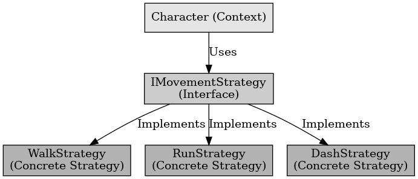

## 전략 패턴

전략 패턴

---

전략 패턴은 디자인 패턴 중 행위 패턴에 해당하는 것으로 인스턴스를 복제하여 사용하는 것을 말한다.
객체의 행위를 변경할 때, 조건문 없이 알고리즘을 캡슐화하여 동적으로 변경이 가능하도록 설계한다.
여러 개의 알고리즘을 선택하여 사용하도록 설계한다.

언리얼 엔진에서는 플레이어의 이동 방식을 전략 패턴으로 관리가 가능하다. 버튼을 입력하면 그에 따라 즉시 이동 방식을 전환할 수 있다.
예를 들어 플레이어가 걸어 다니다 shift 키를 누르는 즉시 달리기로 이동 방식 변경이 가능하다.

 

전략 패턴은 실행 중에 알고리즘을 동적으로 변경할 수 있도록 설계하는 패턴이다.