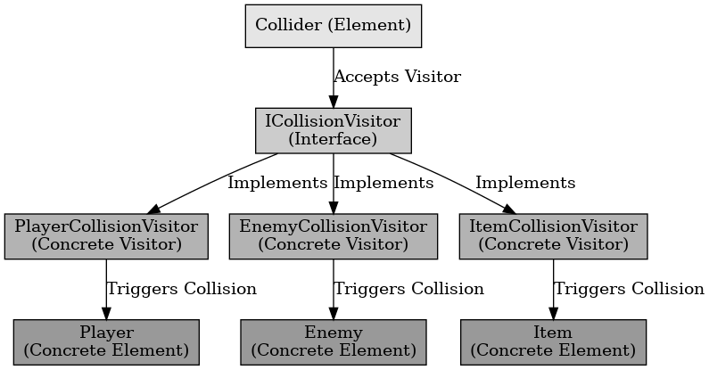

## 방문자 패턴

방문자 패턴

---

방문자 패턴은 디자인 패턴 중 행위 패턴으로 각 클래스들의 데이터 구조에서 처리 기능을 분리하여 별도의 클래스로 구성한다.
객체의 구조는 변경하지 않고, 새로운 동작을 추가할 수 있도록 설계하는 패턴이다.
객체의 데이터를 변경하지 않고 다양한 기능을 추가하는 방법을 제공한다.

언리얼 엔진에서 물리 충돌 처리를 할 때 방문자 패턴을 사용할 수 있다. 플레이어와 적, 오브젝트가 충돌할 때 다 다른 행동을 수행할 경우 사용한다.
예를 들어 플레이어가 오브젝트와 충돌을 하면 못 움직이게 막힐 것이고 플레이어와 적이 충돌을 하면 적이 플레이어를 공격하는 경우를 말할 수 있다.

 

방문자 패턴은 객체 구조를 그대로 유지하면서 새로운 기능을 추가하는 패턴을 말한다.