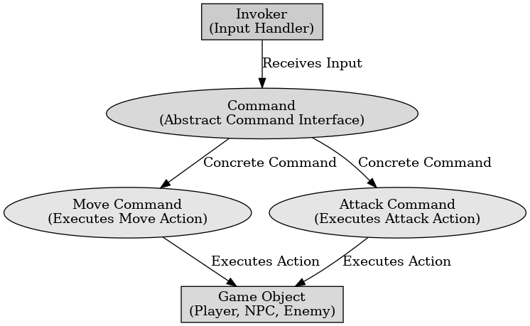

## 게임 프로그래밍 패턴 - 명령

게임 프로그래밍 패턴 - 명령

---

게임 프로그래밍 패턴 중 명령 패턴은 게임 개발에서 행동을 객체로 캡슐화하여 실행 취소, 매크로, 키 입력 처리 등의 기능을 쉽게 구현하도록 하는 패턴이다.

명령 패턴의 기본 구성요소로 4가지가 있다.
Command (명령 인터페이스) : 실행할 동작을 정의하는 인터페이스, 추상 클래스로 주로 Execute() 메서드를 포함한다.
ConcreteCommand (구체적인 명령 클래스) : Command 인터페이스를 구현하며 특정 동작을 실행하는 클래스다.
Invoker (요청자, 명령을 실행하는 객체) : 명령을 저장하고 실행하는 역할을 한다.
Receiver (수신자, 실제 동작을 수행하는 객체) : 명령이 전달되었을 때 실제 동작을 수행하는 객체이다.

명령 패턴의 장점으로는 기존 코드 변경 없이 명령을 추가할 수 있다. 입력과 행동을 분리하여 처리가 가능하고 명령을 스택에 저장하여 실행 취소 기능을 쉽게 구현한다. 여러 개의 명령을 저장하여 한 번에 실행이 가능하다.

 

명령 패턴은 동작을 객체로 만들어 저장하고 실행할 수 있어 유연하고 확장성이 높은 코드를 만들 수 있다.