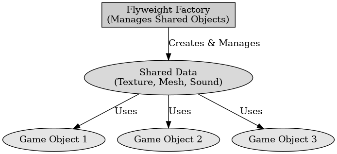

## 게임 프로그래밍 패턴 - 경량화

게임 프로그래밍 패턴 - 경량화

---

게임 프로그래밍 패턴 중 경량화 패턴은 많은 개체가 존재할 때 메모리 사용량을 줄이고 성능을 최적화하기 위한 패턴으로 반복적으로 사용하는 객체들의 공유를 통하여 불필요한 메모리를 줄인다.
게임에서는 주로 탄환 시스템, 적 캐릭터의 애니메이션 데이터, 텍스처, 모델링 데이터를 공유하여 사용한다.

경량화 패턴의 구성요소로는 4가지가 있다.
Flyweight (공유 객체 인터페이스) : 내부 상태를 관리하는 인터페이스이다.
ConcreteFlyweight (구체적인 경량 객체) : 공유 가능한 데이터 저장한다.
FlyweightFactory (팩토리, 공유 객체를 생성 및 관리) : 이미 생성된 객체를 저장하고 재사용한다.
Client (클라이언트) : 필요한 외부 상태를 전달하여 경량 객체를 사용한다.

경량화 패턴의 장점으로는 중복된 객체 생성을 하지 않아 메모리 사용이 감소하고 생성 및 소멸 비용을 줄여 성능을 향상시킨다. 동일한 데이터를 재사용하여 캐싱 효과를 증가시킨다.

단점으로는 내부 상태는 공유되어 개별로 속성을 관리해야 하고 공유 객체와 개별 객체를 분리해야 하기 때문에 코드가 복잡해진다.

 

경량화 패턴은 반복적으로 생성되는 객체의 공유를 이용하여 메모리 사용량을 줄인다.