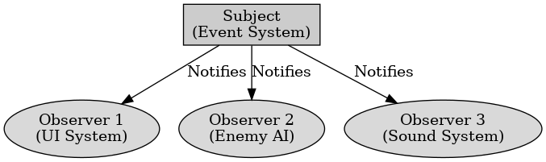

## 게임 프로그래밍 패턴 - 관찰자

게임 프로그래밍 패턴 - 관찰자

---

게임 프로그래밍 패턴 중 관찰자 패턴은 객체의 상태 변화를 다른 객체에게 자동으로 알리는 디자인 패턴으로 주체 객체와 관찰자 객체 간의 일대다 관계를 설정하여 주체 객체의 상태가 변경될 때마다 등록된 모든 관찰자 객체에게 알림을 보낸다.
게임 프로그래밍에서 UI 업데이트, 이벤트 시스템, AI 반응, 사운드 시스템에 사용한다.

구성 요소에는 주체와 관찰자 두 가지가 있다.
Subject (주체) : 상태를 관리하고, 관찰자 목록을 유지하여 상태 변경시 관찰자에게 알림을 보낸다.
Observer (관찰자) : 주체의 상태 변경을 감지하고 처리한다. 주체에 등록되어 있고 주체로부터 알림을 받으면 자동으로 업데이트한다.

관찰자 패턴의 장점은 이벤트 기반 구조로 구현이 가능하여 독립적으로 유지가 가능하고 특정 객체가 다른 객체를 호출할 필요가 없어 객체 간의 결합도를 낮춘다. 원하는 객체만 이벤트를 구독하여 동적으로 구독이 가능하다.

단점으로는 불필요한 이벤트를 호출하면 성능이 저하할 수 있고 여러 객체가 상태를 변경하여 디버깅이 어렵다.

 

관찰자 패턴은 게임 내에서 이벤트 시스템을 쉽게 구축할 수 있도록 한다.