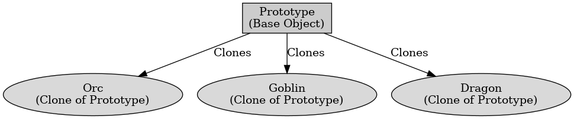

## 게임 프로그래밍 패턴 - 프로토타입

게임 프로그래밍 패턴 - 프로토타입

---

게임 프로그래밍 패턴 중 프로토타입 패턴은 기존 객체를 복제하여 새로운 객체를 생성하는 것으로 객체를 직접 생성하는 것이 아닌 복사하여 사용하여 성능을 향상시키고 코드의 유연성을 높인다.
프로토타입 패턴은 주로 적의 객체를 생성하거나 아이템 시스템, 탄환 시스템에서 사용한다.

프로토타입 패턴은 복제할 원본 객체를 생성하고 생성한 객체를 복사하여 새로운 객체를 생성하는 메서드를 만들고 기존 객체의 속성을 변경하여 다양한 인스턴스를 생성하는 순서로 동작한다.

프로토타입의 장점은 기존 객체를 복제하여 생성 속도를 높이고 원본 객체 속성을 유지하면서 새로운 객체를 생성한다. 새로운 클래스 추가 없이 복제하는 방식으로 다양한 객체 생성이 가능하다.

단점으로는 객체 복사가 깊은 복사인지 얕은 복사인지 고려해야 하고 복제할 객체가 복잡한 구조이면 복사 로직이 복잡할 수 있다.

 

프로토타입 패턴은 기존 객체를 복사하여 새로운 객체를 생성하여 생성 비용을 줄인다.