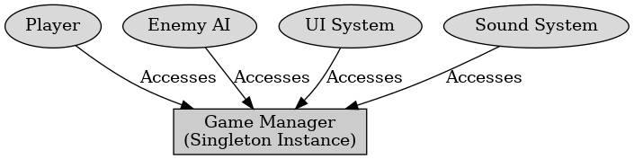

## 게임 프로그래밍 패턴 - 싱글톤

게임 프로그래밍 패턴 - 싱글톤

---

게임 프로그래밍 패턴 중 싱글톤은 특정 클래스의 인스턴스를 오직 하나만 존재하도록 제한하는 디자인 패턴이다.

게임 프로그래밍에서 게임 전반에서 유일한 인스턴스만 필요하고, 모든 곳에서 접근 가능한 시스템에서 사용이 가능하다. 읽기 전용 데이터이거나, 초기화 후 변경할 일이 거의 없는 경우 사용할 수 있다. 이벤트 기반 시스템에서 여러 오브젝트가 같은 이벤트를 수신해야 하면 싱글톤을 활용한 이벤트 디스패처를 사용할 수 있다.

 

싱글톤을 사용하지 말아야 하는 이유

---

1. 유연성과 확장성 부족 : 싱글톤 패턴은 클래스의 인스턴스를 하나로 제안하고 기능 추가나 변경 시 코드의 유지 보수가 어렵다. 특정 클래스가 싱글톤으로 구현될 시 해당 클래스의 기능을 확장하거나 다른 클래스와의 결합도가 높아져 코드의 복잡성이 증가할 수 있다.

2. 다중 스레드에서 문제 : 싱글톤은 다중 스레드 환경에서 사용하면 인스턴스 생성 시 동기화 문제가 발생할 수 있다.

3. 의존성 문제 : 싱글톤 패턴은 다른 클래스들이 싱글톤 인스턴스에 의존하게 한다. 이는 테스트가 어려워지고 코드의 결합도가 높아져 유지 보수가 어려워진다.

4. 전역 상태 관리 어려움 : 싱글톤은 전역 상태를 관리하는 데 사용되지만, 코드의 복잡성을 증가시키고 디버깅을 어렵게 한다.

5. 코드의 재사용성 저하 : 싱글톤은 특정 클래스가 하나의 인스턴스로 제한되어 다른 프로젝트나 상황에서 해당 클래스를 재사용하기 어렵다.