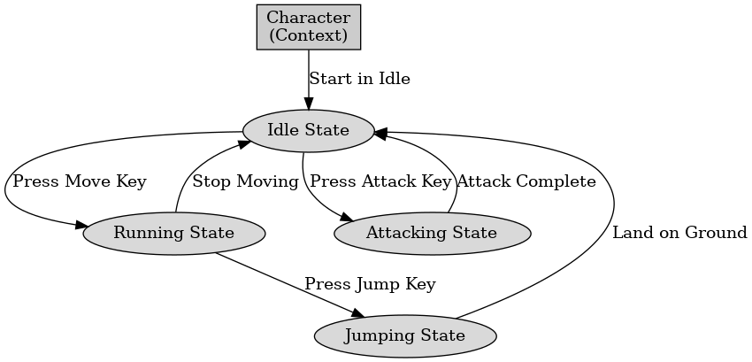

## 게임 프로그래밍 패턴 - 상태

게임 프로그래밍 패턴 - 상태

---

게임 프로그래밍 패턴 중 상태 패턴은 객체의 내부 상태가 바뀜에 따라 객체의 행동을 바꾸는데 유용한 패턴이다. 이는 게임 개발, 사용자 인터페이스 구현, 상태 전환이 빈번할 때 주로 사용한다.

상태 패턴의 구성 요소에는 3가지가 있다.

- Context(문맥) : 상태 객체를 관리하고, 상태에 다른 행동을 한다. 예를 들어 게임 캐릭터의 상태를 관리하는 클래스를 말할 수 있다.
- State(상태 인터페이스) : 상태가 수행해야 할 행동을 정의하는 것으로 캐릭터가 걷거나 점프하는 행동을 정의할 수 있다.
- ConcreteState(구체적인 상태) : 상태 인터페이스를 구현하여 상태별로 구체적인 동작을 정의한다. 예를 들어 걷기 상태와 점프 상태를 구현하는 클래스가 될 수 있다.

게임 프로그래밍에서 주로 플레이어의 상태를 관리하거나 AI의 행동을 관리할 때 사용한다. 게임이 로딩되거나 플레이되거나 종료되는 등의 진행 상태를 관리한다. 또 UI가 열리거나 닫히는 등의 상태를 관리한다.

 

상태 패턴은 게임 프로그래밍에서 필수적인 패턴으로 플레이어와 AI의 상태를 효율적으로 관리한다. 만약 상태 수가 적으면 패턴을 적용할 필요는 없다.