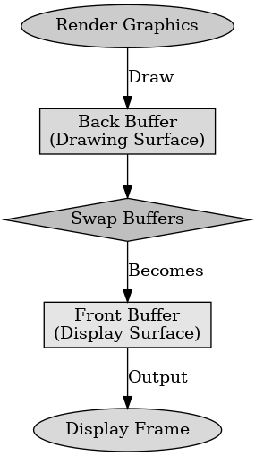

## 게임 프로그래밍 패턴 - 이중버퍼(더블 버퍼링)

게임 프로그래밍 패턴 - 이중버퍼(더블 버퍼링)

---

이중 버퍼 패턴은 게임과 그래픽스 응용 프로그램에서 화면을 부드럽고 끊김 없이 표시하기 위해 사용하는 디자인 패턴이다. 이는 두 개의 버퍼를 사용하여 화면을 업데이트하는 동안 중간 과정을 보이지 않게 하고 사용자에게 완성된 화면만을 보여준다.

이중 버퍼 패턴에는 프런트 버퍼와 백 버퍼가 해당된다. 프런트 버퍼는 현재 화면에 표시되는 버퍼로 비디오 하드웨어가 이 버퍼에서 데이터를 읽어 화면에 출력한다. 백 버퍼는 다음 프레임을 렌더링 하는 버퍼로 렌더링 코드는 이 버퍼에 새로운 프레임을 그린다.

렌더링 코드는 백 버퍼에 새로운 프레임을 그리고 렌더링이 완료되면 프런트 버퍼와 백 버퍼를 교체한다. 이전 프런트 버퍼가 새로운 백 버퍼가 되어 다음 프레임을 준비한다.

이중 버퍼의 장점은 화면 깜빡임이나 테어링 현상을 방지하여 부드러운 화면 전환이 가능하다. 렌더링 코드가 백 버퍼에 작업을 수행하는 동안, 비디오 하드웨어는 프런트 버퍼에서 데이터를 읽어 화면에 출력 가능하다.

이중 버퍼의 단점은 두 개의 버퍼를 유지해야 하기 때문에 메모리 사용량이 증가한다. 이는 메모리 제한이 있으면 문제가 될 수 있다. 버퍼 교체 연산이 빠르게 수행되어야 하고 그 과정에서 시간이 걸리면 성능에 영향이 간다.

