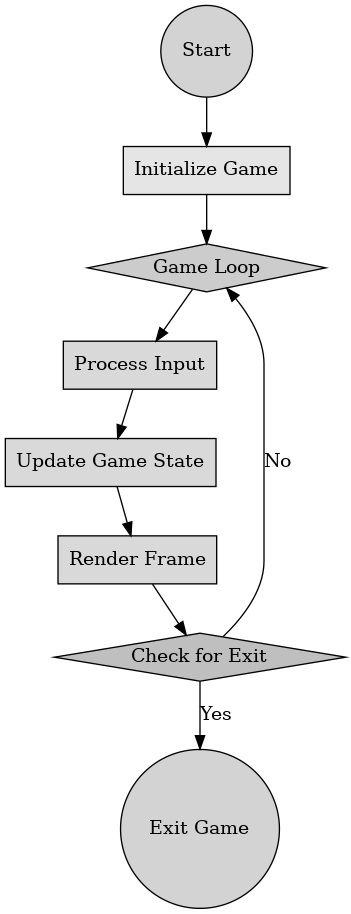

## 게임 프로그래밍 패턴 - 게임 루프

게임 프로그래밍 패턴 - 게임 루프

---

게임 프로그래밍 패턴 중 게임 루프 패턴은 게임 소프트웨어의 전체적인 흐름을 제어하는 디자인 패턴이다. 이는 게임이 시작된 후 종료될 대까지 반복적으로 실행되고 사용자 입력 처리, 게임 상태 업데이트, 화면 렌더링 등의 작업을 수행한다.

게임 루프의 구성 요소

- 입력 처리(Process Input) : 사용자로부터 입력을 받아 게임에 반영할 명령을 생성한다. 예를 들어 키보드나 마우스의 입력을 말한다.
- 업데이트(Update) : 입력 처리 결과를 바탕으로 게임의 상태를 업데이트한다. 물리 엔진 계산, AI 처리, 캐릭터 위치 변경 등 다양한 연산을 포함한다.
- 렌더링(Render) : 업데이트된 게임 상태를 화면에 출력한다. 이는 그래픽스 처리와 관련이 많다.
- 타이밍 조절(Frame Timing) : 일정한 프레임 속도를 유지하도록 시간을 조절한다.

게임 루프는 게임이 실행되는 동안 지속적으로 반복한다. 사용자의 입력이 없어도 게임이 계속 실행되고 이는 몬스터의 자동 이동이나 시간 기반 이벤트 처리 등에서 중요하다. 게임의 부드러움을 위해 일정 프레임을 유지하는 것이 중요하다.

게임 루프의 장점으로는 사용자 입력에 즉각적으로 반응이 가능하고 게임 상태를 지속적으로 업데이트하여 동적인 환경을 구현할 수 있다.

게임 루프의 단점으로는 입력 처리, 업데이트, 렌더링 등의 과정이 복잡할 수 있다. 부드러운 게임 플레이를 위해 최적화를 해야 한다.

 

