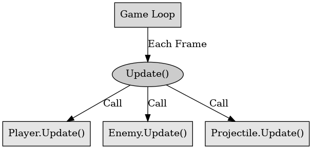

## 게임 프로그래밍 패턴 - 업데이트 메서드

게임 프로그래밍 패턴 - 업데이트 메서드

---

업데이트 메서드는 게임 루프의 중요한 구성 요소로 게임 상태를 매 프레임마다 업데이트하는 역할을 한다. 이는 게임 내의 모든 개체가 자신의 상태를 갱신하도록 하여, 게임의 동적 환경을 구현한다. 

각 개체가 자신의 동작을 캡슐화하여 매 프레임마다 상태를 업데이트한다. 이는 캐릭터의 위치, 속도 방향 등을 업데이트한다. 업데이트 메서드에서 게임의 주요 로직을 실행한다. 이는 캐릭터 이동, 충돌 검사, AI 처리 등을 한다.

추상 메서드를 사용하면 각 개체가 자신의 동작을 캡슐화하기 위해 추상 메서드인 Update()를 정의한다. 이를 이용하여 모든 개체가 자신의 상태를 업데이트 가능하다. 게임 월드는 객체 컬렉션을 관리하며 매 프레임마다 컬렉션에 있는 모든 개체를 순회하여 Update() 메서드를 호출한다.

업데이트 메서드의 장점으로는 새로운 개체를 추가하거나 기존 개체의 동작을 변경할 때 코드의 복잡성이 증가하지 않는다. 각 개체가 자신의 동작을 캡슐화하여 코드의 가독성이 향상된다.

업데이트 메서드의 단점으로는 업데이트 순서가 중요하여 순차적으로 업데이트한다. 만약 병렬 업데이트를 하면 로직이 꼬일 수 있다. 업데이트 도중 객체 목록을 수정하는 것은 줄여야 하고 삭제 예정 객체에 플래그를 설정하거나 별도의 컬렉션을 사용하는 것이 좋다.

 

