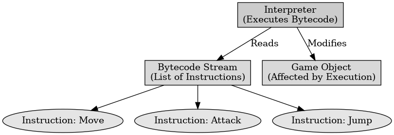

## 게임 프로그래밍 패턴 - 바이트 코드

게임 프로그래밍 패턴 - 바이트 코드

---

바이트 코드 패턴은 게임 프로그래밍에서 복잡한 행동을 데이터로 정의하고 가상 머신에서 실행하는 디자인 패턴이다. 이는 게임 내의 다양한 객체나 캐릭터의 행동을 쉽게 수정하고 확장할 수 있도록 한다.

바이트 코드는 행동을 코드가 아닌 데이터로 정의하고, 게임 디자이너가 프로그래머의 도움 없이 게임의 동작을 쉽게 변경하도록 한다. 바이트 코드는 가상 머신에서 실행되고 이는 다양한 플랫폼에서 동일한 코드를 실행할 수 있는 이점이 있다.

바이트 코드의 구성 요소는 인스트럭션 세트, 바이트 코드, 가상 머신이 있다. 
- 인스트럭션 세트 : 가상 머신에서 실행할 수 있는 기본적인 연산을 정의한다. 숫자를 더하거나 변수에 값을 할당하는 연산이 포함될 수 있다. - 바이트 코드 : 인스트럭션 세트를 사용하여 복잡한 행동을 데이터로 인코딩한 결과물이다. 이는 가상 머신에서 실행될 수 있는 형태로 저장된다. 
- 가상 머신 : 바이트 코드를 해석하고 실행하는 소프트웨어 환경이다. 가상 머신은 바이트 코드를 읽어 기계어로 변환하거나 직접 실행한다.

바이트 코드의 장점은 가상 머신에서 실행되어 다양한 플랫폼에서 동일한 코드를 실행할 수 있고, 게임 디자이너가 코드를 수정하지 않고도 게임 동작을 쉽게 변경 가능하다. 가상 머신은 바이트 코드의 실행을 제어하여 보안을 강화할 수 있다.

바이트 코드의 단점은 바이트 코드를 해석하고 실행하는 과정에서 성능 오버헤드가 발생할 수 있고 가상 머신을 구현하고 관리하는 것이 복잡하다.

 

