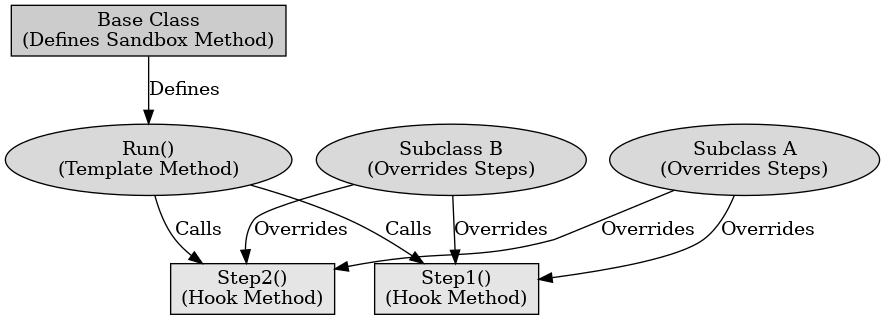

## 게임 프로그래밍 패턴 - 하위 클래스 샌드박스

게임 프로그래밍 패턴 - 하위 클래스 샌드박스

---

하위 클래스 샌드박스 패턴은 상위 클래스가 제공하는 기능을 사용하여 하위 클래스에서 행동을 정의하는 디자인 패턴이다. 이 패턴은 여러 하위 클래스가 공통으로 사용할 수 있는 코드를 상위 클래스에서 모아 중복을 줄이고 하위 클래스 간의 결합도를 낮춘다.

상위 클래스는 추상적인 샌드박스 메서드와 여러 제공 기능을 정의한다. 제공한 기능은 protected로 선언하여 하위 클래스에서만 사용하도록 한다.
하위 클래스는 상위 클래스에서 제공하는 기능을 사용하여 샌드박스 메서드를 구현한다.

하위 클래스 샌드박스 패턴의 장점으로는 하위 클래스 간의 중복 코드를 상위 클래스로 이동하여 코드 중복을 줄인다. 하위 클래스 간의 결합도를 줄이고 상위 클래스와의 결합만 유지하여 코드의 유지 보수가 용이해진다. 새로운 하위 클래스를 추가하거나 기존 클래스의 동작을 변경할 때 상위 클래스의 제공 기능만 수정하면 된다.

하위 클래스 샌드박스 패턴의 단점으로는 상위 클래스가 하위 클래스와의 커플링이 강해지며, 상위 클래스의 수정이 어려워질 수 있다. 상위 클래스가 여러 시스템과 강하게 결합되면, 상위 클래스의 변경이 전체 시스템에 영향을 줄 수 있다.

 

