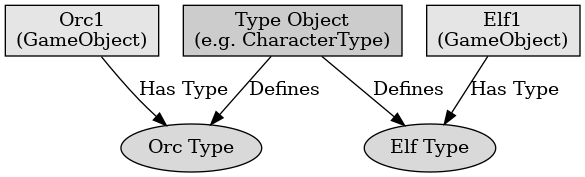

## 게임 프로그래밍 패턴 - 타입 객체

게임 프로그래밍 패턴 - 타입 객체

---

타입 객체 패턴은 다양한 타입을 정의할 때 컴파일이나 코드 변경 없이 새로운 타입을 추가하거나 수정하도록 하는 디자인 패턴이다. 이는 데이터 중심으로 구분되는 타입을 정의할 때 유용하고 게임 개발에서는 몬스터나 캐릭터 클래스와 같은 다양한 타입을 관리하는데 적절하다.

타입 객체 패턴은 타입 객체와 타입 사용 객체를 가지고 있다.
- 타입 객체 : 각 타입 객체 인스턴스는 논리적으로 다른 타입을 의미한다. 이는 타입에 공통적인 데이터나 동작을 정의한다.
- 타입 사용 객체 : 타입 사용 객체는 자신의 타입을 설명하는 타입 객체에 대한 참조를 저장한다. 각 인스턴스는 타입 객체의 데이터를 사용하여 자신의 행동을 정의한다.

타입 객체 패턴의 장점은 코드 변경 없이 새로운 타입을 추가하거나 기존 타입을 수정할 수 있다. 타입을 데이터로 정의하여 코드 수정 없이도 다양한 타입을 쉽게 관리할 수 있다.

타입 객체 패턴의 단점으로는 타입 객체를 수동으로 관리해야 하고 이는 메모리 관리와 관련된 추가적인 복잡성을 만들 수 있다. 서브 클래스에서 메서드를 재정의하여 다양한 동작을 정의 가능하지만 타입 객체 패턴에서는 데이터를 통해 동작을 정의하는것이 더 어렵다.

 

