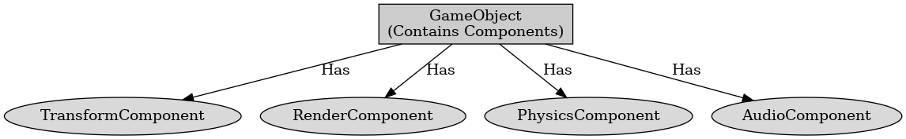

## 게임 프로그래밍 패턴 - 컴포넌트

게임 프로그래밍 패턴 - 컴포넌트

---

컴포넌트 패턴은 게임 오브젝트의 다양한 기능을 각각의 독립적인 컴포넌트로 나누어 관리하는 디자인 패턴이다. 이는 상속 기반의 계층 구조 설계의 문제점을 보안하기 위한 것이다.

컴포넌트 패턴의 구성 요소에는 게임 오브젝트와 컴포넌트가 있다.

- 게임 오브젝트 : 컴포넌트의 컨테이너 역할로 컴포넌트를 조립하여 기능을 추가한다.
- 컴포넌트 : 각 컴포넌트는 특정 기능을 담당하여 독립적으로 동작할 수 있다. 위치 관리, 렌더링, 물리 충돌 등이 있다.

컴포넌트의 장점으로는 필요한 기능만을 가진 컴포넌트를 선택적으로 사용하여 코드의 재사용성이 높다. 독립적으로 사용하고 기능 추가나 삭제 시 다른 컴포넌트에 영향을 미치지 않는다.

컴포넌트 패턴의 단점으로는 컴포넌트를 관리하고 조립하는 과정에서 코드가 복잡해질 수 있고 컴포넌트 간의 통신이 필요한 경우 관리하는 게 어렵다.

 

