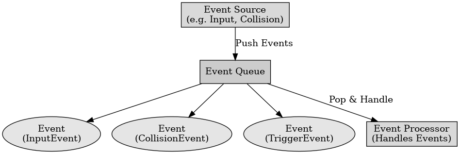

## 게임 프로그래밍 패턴 - 이벤트 큐

게임 프로그래밍 패턴 - 이벤트 큐

---

이벤트 큐 패턴은 게임에서 발생하는 이벤트나 메시지를 즉시 처리하지 않고 큐에 저장해두었다가 나중에 처리하는 디자인 패턴이다. 이는 이벤트 발생 시점과 처리 시점을 디커플링하여, 게임의 반응성을 높이고 시스템 간의 결합도를 낮추는데 유용하다.

이벤트 큐의 구성 요소에는 이벤트 큐, 이벤트 발생자, 이벤트 처리자가 있다.
- 이벤트 큐 : 이벤트나 메시지를 저장하는 자료구조로 큐 형태로 구현된다.
- 이벤트 발생자 : 이벤트를 발생시키는 객체로 이벤트가 발생하면 큐에 추가한다.
- 이벤트 처리자 : 큐에서 이벤트를 처리하는 객체이다.

이벤트 큐의 장점은 이벤트 발생 시점과 처리 시점을 분리하여 비동기적으로 처리할 수 있다. 이는 게임의 반응성을 높이고 시스템 간의 결합도를 낮춘다. 여러 이벤트를 모아 한 번에 처리하거나 동일한 이벤트를 묶어 처리할 수 있어 효율성을 높일 수 있다. 이벤트 큐를 통해 스레드 간의 협동을 용이하게 구현이 가능하다.

이벤트 큐의 단점은 큐를 관리하고 이벤트를 처리하는 로직이 복잡해질 수 있고, 비동기 처리로 인하여 이벤트 처리 시점이 예측하기 어려워 버그를 추적하기 어렵다.

이벤트 큐는 주로 키 입력, 마우스 입력, 충돌 처리 등의 게임 이벤트를 처리하거나 사운드를 순차적으로 처리하고 AI의 명령이나 행동을 이벤트 큐에 저장하여 순차 처리하는 역할을 한다.

 

