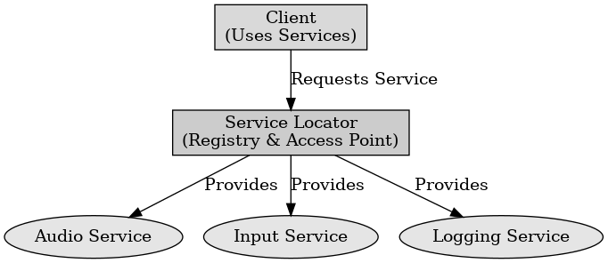

## 게임 프로그래밍 패턴 - 서비스 중개자

게임 프로그래밍 패턴 - 서비스 중개자

---

서비스 중개자 패턴은 다양한 서비스나 컴포넌트가 서로 통신할 수 있도록 중개자를 도입하는 디자인 패턴이다. 이는 서비스를 사용하는 코드가 서비스의 구체적인 내용을 알지 못하도록 하여 서비스 간의 결합도를 낮추고 유연성을 높인다.

서비스 중개자 패턴의 구성 요소에는 서비스 인터페이스, 서비스 제공자, 서비스 중개자가 있다. 
- 서비스 인터페이스 : 서비스의 기능을 정의하는 인터페이스로 구체적인 서비스 제공자는 이 인터페이스를 구현한다.
- 서비스 제공자 : 서비스 인터페이스를 구현한 구체적인 클래스이다.
- 서비스 중개자 : 서비스 인터페이스를 저장하고 서비스를 제공하는 역할을 한다. 서비스 중개자는 제공자를 등록하고 이를 호출하는 코드에서 사용하도록 한다.

서비스 중개자 패턴의 장점으로는 서비스를 사용하는 코드가 서비스의 구체적인 내용을 알지 않아도 되고 서비스 간의 결합도가 낮아진다. 서비스 제공자를 쉽게 교체할 수 있어 다양한 환경에서 유연하게 대응할 수 있다. 서비스의 구체적인 내용이 변경되어도 서비스 중개자를 통해 쉽게 관리가 가능하다.

서비스 중개자 패턴의 단점으로는 서비스 중개자를 관리하는 코드가 추가되어 시스템의 복잡성을 증가시킬 수 있다. 서비스 제공자가 등록되어 있어야 한다.

 

