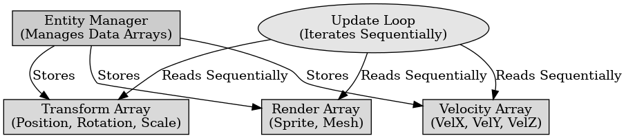

## 게임 프로그래밍 패턴 - 데이터 지역성

게임 프로그래밍 패턴 - 데이터 지역성

---

데이터 지역성 패턴은 데이터를 메모리에서 효율적으로 관리하여 캐시 사용을 최적화하고 데이터 접근 시간을 줄이는 디자인 패턴이다. 이는 고성능 컴퓨팅, 실시간 데이터 처리, 게임 개발에서 중요한 역할을 한다.

데이터 지역성은 데이터를 메모리에서 효율적으로 배치하여 캐시 히트율을 높이고 캐시 미스를 줄인다. 데이터가 메모리에서 가까이 위치하도록 하여 데이터 접근 시간을 줄인다.

데이터 지역성 패턴에는 데이터 구조 조직과 캐시 친화적 디자인이 있다.
- 데이터 구조 조직 : 데이터를 메모리에서 효율적으로 배치하여 자주 사용되는 데이터가 서로 가까이 위치하도록 한다.
- 캐시 친화적 디자인 : 데이터 구조를 캐시 친화적으로 설계하여, 캐시 라인이 효율적으로 사용되도록 한다.

데이터 지역성 패턴의 장점으로는 캐시 사용을 최적화하여 데이터 접근 시간을 줄이고, 전체 시스템 성능을 향상시킨다. 데이터를 효율적으로 배치하여 메모리 사용을 최적화한다.

데이터 지역성의 단점으로는 데이터 구조를 캐시 친화적으로 설계하는 것이 복잡할 수 있고 캐시 미스가 성능 문제의 원인이 아닐 경우 데이터 지역성 패턴을 적용하는 것이 불필요할 수 있다.

 

