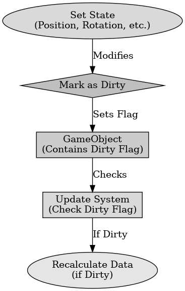

## 게임 프로그래밍 패턴 - 더티 플래그

게임 프로그래밍 패턴 - 더티 플래그

---

더티 플래그 패턴은 불필요한 작업을 피하기 위해 실제로 필요할 때까지 그 일을 미루는 패턴을 말한다. 이는 값의 변경이 일어나야 하는 상황을 플래그로 설정해두고 필요한 상황에만 갱신을 하도록 한다. 이로 퍼포먼스를 향상하고 불필요한 연산을 줄일 수 있다.

더티 플래그 패턴의 구성 요소에는 더티 플래그, 기본 데이터, 파생 데이터가 있다.
- 더티 플래그 : 값이 변경되었음을 나타내는 플래그로 bool 형태로 구현된다. 값이 변경되면 플래그가 설정된다. 
- 기본 데이터 : 실제로 변경되는 데이터이다.
- 파생 데이터 : 기본 데이터를 기반으로 계산된 데이터로 더티 플래그가 설정되면 갱신된다.

더티 플래그 패턴의 장점으로는 값이 변하지 않았을 때 중복 계산을 피할 수 있어 퍼포먼스를 향상한다. 불필요한 연산을 줄여 CPU 자원을 절약한다.

더티 플래그 패턴의 단점으로는 더티 플래그를 관리하는 코드가 추가되어 이는 시스템의 복잡성을 증가시킬 수 있다. 더티 플래그가 올바르게 설정되지 않으면 버그를 추적하기 어렵다.

 

