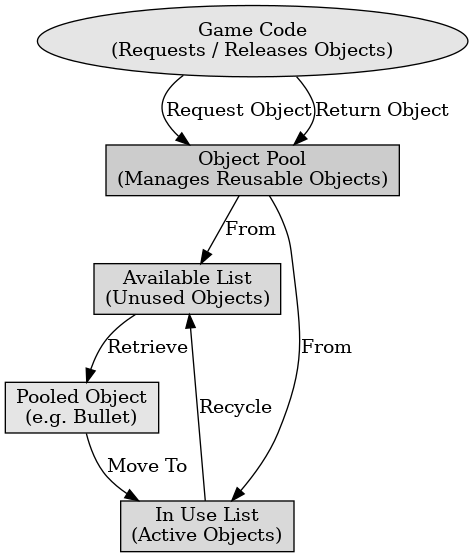

## 게임 프로그래밍 패턴 - 객체 풀

게임 프로그래밍 패턴 - 객체 풀

---

객체 풀 패턴은 반복적으로 생성되고 소멸되는 객체를 미리 생성하여 풀에 저장하고, 필요할 때 꺼내 사용하고 다시 반환하여 재사용하는 디자인 패턴이다. 이 패턴은 메모리 할당 및 해제의 비용을 줄이고, 성능을 향상시키기 위해 주로 사용한다.

객체 풀 패턴의 구성 요소에는 풀과 풀 관리자, 클라이언트가 있다.
- 풀 : 미리 생성된 객체를 저장하는 자료구조로 일반적으로 리스트, 큐, 스택을 사용한다.
- 풀 관리자 : 풀에서 객체를 가져오거나 반환하는 역할을 담당한다. 필요에 따라 새로운 객체를 생성하거나 풀에 반환한다.
- 클라이언트 : 풀에서 객체를 요청하여 사용 후 반환한다.

객체 풀 패턴의 장점으로는 객체 생성 및 소멸 비용을 줄열 성능을 향상시킨다. 메모리 단편화를 줄여 메모리 사용 효율성을 높이고 객체를 재사용하여 리소스 낭비를 줄인다.

객체 풀 패턴의 단점으로는 풀을 관리하는 코드가 추가되고 이는 시스템의 복잡성을 증가시킨다. 초기에 많은 메모리를 할당해야 하므로 메모리 사용량이 증가할 수 있다.

 

