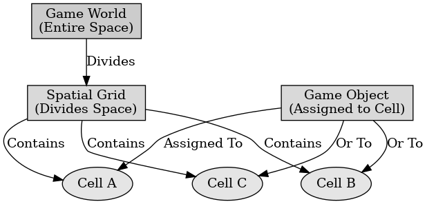

## 게임 프로그래밍 패턴 - 공간분할

게임 프로그래밍 패턴 - 공간분할

---

공간 분할 패턴은 개임 내 객체들을 효율적으로 관리하기 위해 공간을 여러 영역으로 나누고 객체를 해당 영역에 저장하여 성능을 최적화하는 디자인 패턴이다. 이 패턴은 주로 충돌 감지, 렌더링 최적화, 레이 트레이싱 등 위치 기반 작업에서 사용한다.

공각 분할 패턴의 목적으로는 객체 간의 충돌 검출이나 거리 계산 같은 작업에서 모든 객체를 비교하지 않고, 특정 영역 내의 객체만 검사하여 성능을 향상시킨다. 메모리 사용량을 줄이고, 필요한 객체만 처리하여 효율성을 높인다. 뷰포트 내에서 필요한 객체만 렌더링 하여 불필요한 계산을 줄이고 정확한 결과를 제공한다.

공간 분할 패턴의 구조에는 쿼드 트리, 옥트 트리, BSP 트리가 있다.
- 쿼드 트리 : 2D 공간을 4개의 사각형 영역으로 나눈다. 2D 게임에서 주로 사용하고 객체가 많은 경우 영역을 재귀적으로 세분화한다.
- 옥트 트리 : 3D 공간을 8개의 큐브로 나누고 3D 게임 및 어플리케이션에서 사용된다.
- BSP 트리 : 공간을 이진 트리로 분할하여 관리한다. 복잡한 실내 환경이나 레이 트레이싱에서 자주 사용한다.

공간 분할 패턴의 장점으로는 특정 영역 내 객체만 검사하여 탐색 시간이 줄어든다. 객체가 많아질수록 성능 향상이 커지며, 대규모 게임에서 효과가 크다. 충돌 검출 시 모든 객체를 비교하지 않고 특정 영역 내의 객체만 처리한다.

공간 분할 패턴의 단점으로는 자료구조를 설계하고 관리하는 코드가 복잡해질 수 있다. 각 영역에 대한 데이터 관리와 객체 저장을 위한 추가 메모리가 필요하다. 객체가 자주 이동하면 자료구조를 지속적으로 업데이트해야 하므로 성능 저하가 발생할 수 있다.

 

