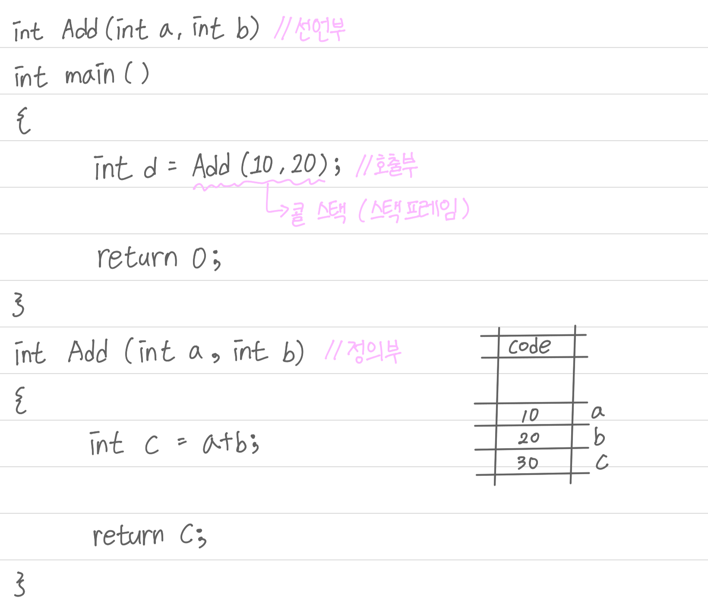

## Visual C++

#### 함수 호출

```c++
#include <stdio.h>

int Add(int a, int b); //선언부

int main()
{
   int d = Add(10, 20); //호출부

   printf("d = %d\n",d);

   return 0;
}

int Add(int a, int b) //정의부
{
   int c = a + b;

   printf("%d + %d = %d\n", a, b, c);

   return c;
}
```
> 10 + 20 = 30
d = 30

<br/>

#### cdecl

cdecl은 C언어에서 기본적으로 사용하는 함수 호출 규약으로 함수를 호출하는 Caller에서 스택을 정리하는 방식이다.

위에 코드에서 보면 가장 먼저 Stack에 20, 10 순서로 저장을 하고 Add 함수를 호출한다. 함수에서는 Stack Pointer로 Stack에 저장된 데이터를 사용한 뒤 값을 return 하여 d에 return 값을 저장해 준다. return이 끝나면 main으로 돌아오면 main에서 Stack이 삭제되고 Stack Pointer도 뒤로 이동한다.

<br/>

#### stdcall

stdcall은 cdecl과 비슷한 형태를 가지고 있지만 Callee에서 스택 프레임을 정리해 준다.

함수의 마지막 return 과정에서 cdecl은 main으로 돌아와서 Stack을 삭제를 했지만 stdcall은 함수에서 삭제를 해준다.

ESP(Extended Base Pointer Register)는 Stack Frame의 베이스 주소(처음 주소)를 저장하는 레지스터이고, ESP(Extended Stack Pointer Register)는 스택의 최상단 주소를 저장하는 레지스터를 말한다.

{: width="100%" height="100%"}

<br/>

#### Swap

약한 참조로 Swap을 할 경우 두 값이 바뀌지 않는다.

이러한 경우를 해결하기 위한 방법이 두 가지 있는데 레퍼런스를 사용하거나 포인터를 사용하는 것이다.

```C++
//void Swap(int& a, int& b)
void Swap(int* a, int* b)
{
   int temp = *a;
   *a = *b;
   *b = temp;

   printf("*a = %d, *b = %d\n", a, b);
}
int main()
{
   int c = 20;
   int d = 30;

   printf("c = %d, d = %d\n", c, d);

   Swap(&c, &d);

   printf("c = %d, d = %d\n", c, d);

   return 0;
}
```

> c = 20, d = 30
> *a = 9436760, *b = 9436748
> c = 30, d = 20

{: width="100%" height="100%"}

<br/>

#### 이차 포인터

```C++
#include <stdio.h>

int main()
{
   int a = 10;
   int* b = &a;
   int** c = &b;

   printf("a = %d\n", a); //a의 값
   printf("*b = %d\n", *b); //b의 값
   printf("**c = %d\n", **c);; //c의 값

   printf("\n\n");

   printf("&a = %p\n", &a); //a의 주소
   printf("b = %p\n", b); //a의 주소
   printf("*c = % p\n", *c); //a의 주소

   printf("\n\n");

   printf("&b = %p\n", &b); //b의 주소
   printf("c = %p\n", c); //b의 주소

   printf("\n\n");

   printf("&c = %p\n", &c); //c의 주소

   return 0;
}
```

> a = 10
> *b = 10
> **c = 10

> &a = 0x100
> b = 0x100
> *c = 0x100

> &b = 0x500
> c = 0x500

> &c = 0x1000

{: width="100%" height="100%"}

<br/>

#### Allocate
메모리를 동적 할당해 주는 것으로 사용이 끝나면 반드시 free를 사용해야 한다. malloc을 이용한 코드는 사용이 끝나면 free를 이용하고 new는 delete, VirtualAlloc은 Virtualfree를 이용해야 한다. malloc은 필요한 Byte의 공간을 잡아 이용한다.

```C++
#include <stdio.h>
#include <Windows.h>

void Allocate_Malloc()
{
   void* p = malloc(20);
   int* pi = (int*)p;

   pi[0] = 1;
   *(pi + 1) = 2;

   for (int i = 0; i < 5; i++)
      pi[i] = i + 1;

   for (int i = 0; i < 5; i++)
      printf("pi[%d] = %d\n", i, pi[i]);

   free(p);
}

int main()
{
   Allocate_Malloc();

   return 0;
}
```

> pi[0] = 1
> pi[1] = 2
> pi[2] = 3
> pi[3] = 4
> pi[4] = 5

{: width="100%" height="100%"}
