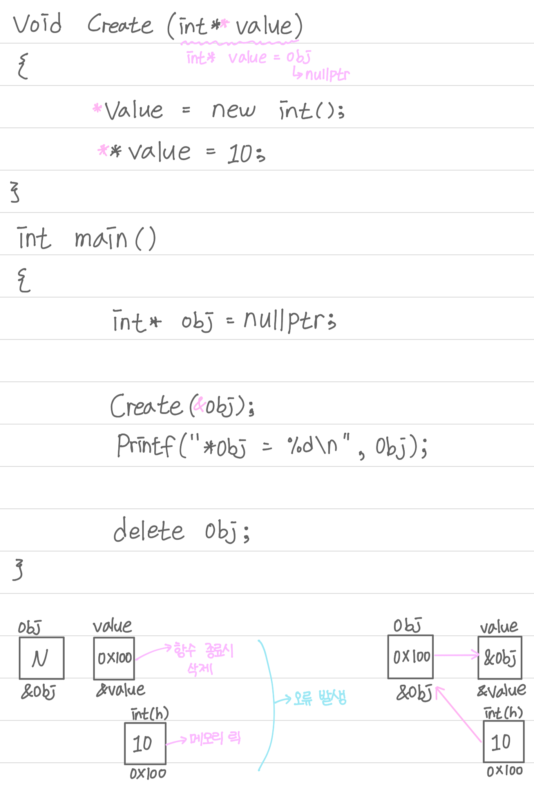

## Visual C++ - 4

## DoublePointer2

```cpp
#include <stdio.h>

void Create(int** value)
{
	*value = new int();
	**value = 10;
}

int main()
{
	int* obj = nullptr;

	Create(&obj);
	printf("*obj = %d\n", *obj);

	delete obj;

	return 0;
}
```

{: width="100%" height="100%"}

<pr/>

## 디컴파일링

디컴파일링은 실행된 exe 파일을 다시 뒤집어 code로 만드는 것인데 디컴파일링을 하면 설계한 코드가 아닌 실행된 내용의 코드 (저 수준 언어)가 나오는 것으로 추상화와 같은 설계가 나오지 않아 설계한 코드랑은 다르다. 

CPU에 Decorder 명령어 해석기가 있는데 code 영역에 있는 명령어를 실행시킨다. 번역이 단어 치환 수준, 1 대 1로 매칭되면 저 수준 언어라고 한다. C는 저 수준 언어에 해당된다.

명령어를 함축시킨 것을 추상화라고 하고 이를 번역할 수 있는 언어를 고수준 언어라고 한다. C++은 고수준 언어에 해당된다.

Unreal이나 Unity는 디컴파일링을 하면 설계한 코드 전체가 나온다. 이를 막기 위해 하는 것을 난독화라고 한다.

<pr/>

## 접근 제어자(access modifier)

접근 제어 자는 변수나 메서드의 사용 권한을 설정하는 것으로 private, default, protected, public이 있다.

private는 해당 클래스 안에서만 접근이 가능하다.

default는 따로 접근 제어자를 설정하지 않으면 자동으로 설정된다.

protected는 동일 클래스나 해당 클래스를 상속받은 클래스에서 사용이 가능하다.

public은 어느 클래스든 사용이 가능하다.

구조체와 클래스의 차이는 구조체는 struct, 클래스는 class를 사용하는 것과 구조체는 기본적으로 public 접근 제어자를,  클래스는 private 접근 제어자를 사용한다.

<pr/>

## 직/간접 접근 지정자

직접 접근 지정자는 (.), 간접 접근 지정자는 (→)이다. 접근 참조는 변수에 접근하여 자료값을 읽거나 복사하거나 변경하고 간접 참조는 변수의 주소를 통해 자료값을 복사하거나 변경한다.

Pointer로 주소 값을 받으면 간접 접근 지정자로 해당 주소의 변수에 접근이 가능하다.

{: width="100%" height="100%"}

<pr/>

## Struct

Vector2D.h
```cpp
#pragma once

struct Vector2D
{
public:
	Vector2D();
	Vector2D(float X, float Y);

	void Print();

public:
	float X;
	float Y;
};
```

Vector2D.cpp
```cpp
#include <stdio.h>
#include "Vector2D.h"

Vector2D::Vector2D()
	//: X(0.0f), Y(0.0f)
{
	//X = 0.0f;
	//Y = 0.0f;

	X = Y = 0.0f;
}

Vector2D::Vector2D(float X, float Y)
	:X(X), Y(Y)
{
	//this->X = X;
}

void Vector2D::Print()
{
	printf("X = %f, Y = %f\n", X, Y);
}
```

Main.cpp
```cpp
#include <stdio.h>
#include "Vector2D.h"

void Create(Vector2D** object, float x)
{
	*object = new Vector2D(x, 0.0f);
	(*object)->Y = 20;
}

int main()
{
	Vector2D vector;
	vector.X = 100;
	vector.Y = 200;
	vector.Print();

	Vector2D vector2(200, 300);
	vector2.Print(); //직접접근 (. 직접접근 지정자)

	Vector2D* p = &vector;
	p->X = 200; //간접접근 (-> 간접접근 지정자)
	(*p).Y = 300;
	(*p).Print();

    printf("\n");
    
	printf("%p, %p\n", &vector, p);
	printf("%p, %p\n", &vector.X, &p->X); //X가 시작 주소라 위에 출력과 같다.

    printf("\n");

	Vector2D arr[5];
	arr[0].X = 10;
	arr[0].Print();

	Vector2D* pArr = arr;
	pArr->Print();

	(pArr + 1)->X = 20;
	(*(pArr + 1)).Y = 30;
	pArr[1].Print();

	float* fp = &pArr[1].X;
	*fp = 40;
	pArr[1].Print();

	Vector2D* c= nullptr;
	Create(&c, 5.0f);
	c->Print();

	delete c;
	c = nullptr;

	return 0;
}
```

<pr/>

{: width="100%" height="100%"}